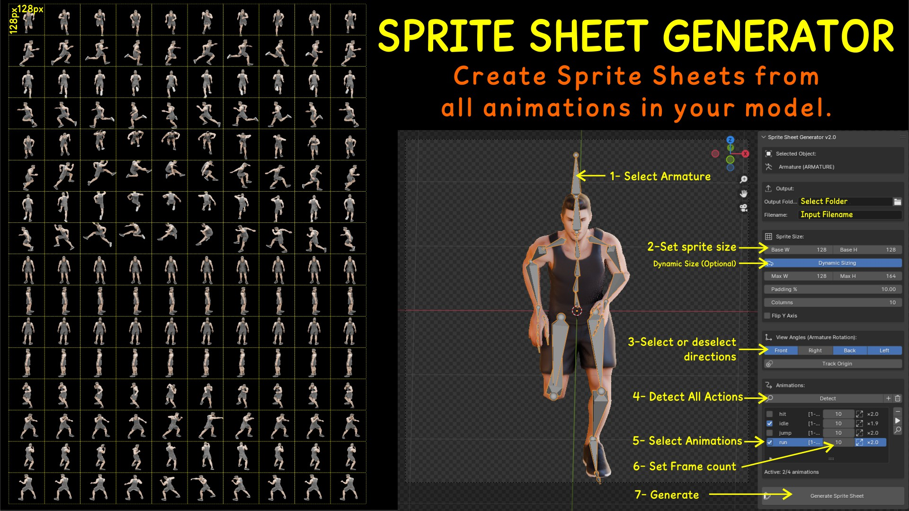
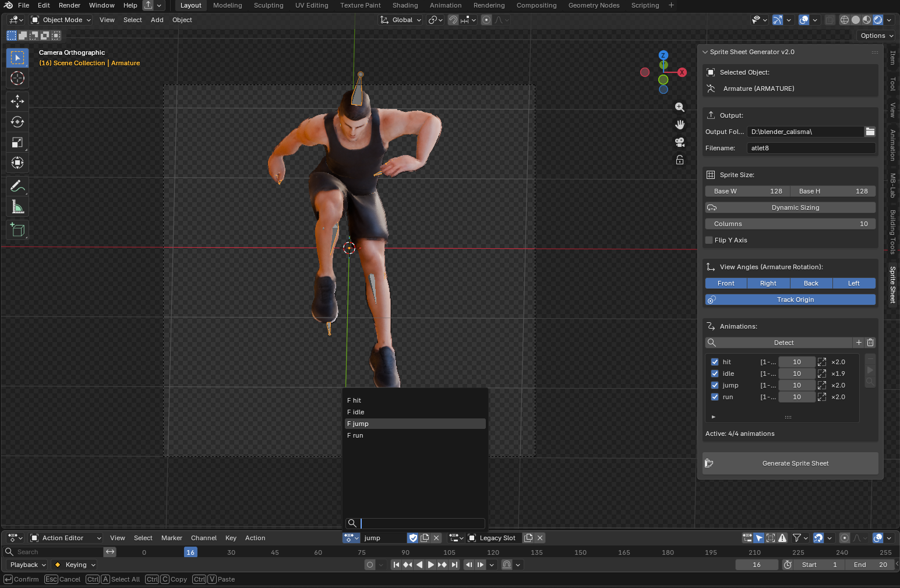
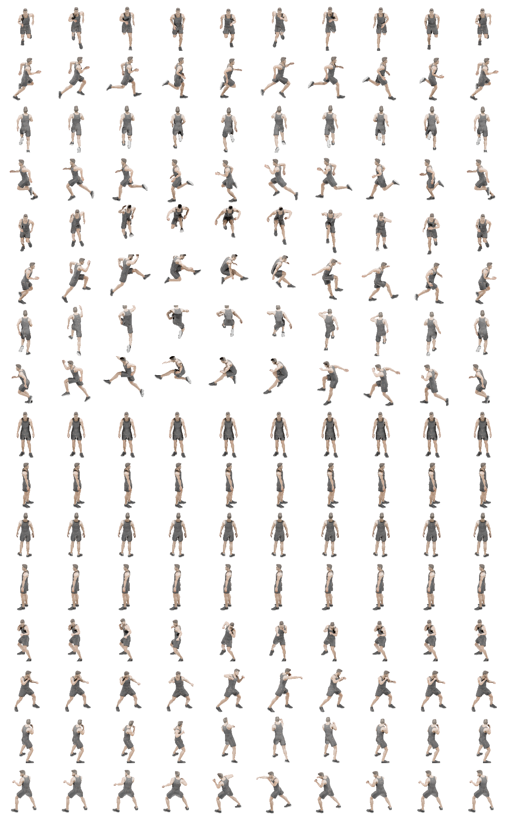

# Sprite Sheet Generator for Blender

A powerful Blender add-on for converting 3D animations into sprite sheets for game development.

version: 2.0.0
compatibility: Blender 3.6 and newer
tested version: Blender 3.6.3 - 4.0.2 - 5.1.1
License: GPL-3.0

## Features

🎮 Multi-Animation Support
Process all your character animations at once - idle, run, jump, attack, fall, and more. The add-on automatically detects all actions in your armature and generates a unified sprite sheet.

🔄 Armature Rotation Mode
Unlike other tools that rotate the camera, Sprite Sheet Generator rotates the armature itself. This ensures:
- Consistent lighting from a single direction
- No shadow inconsistencies between angles
- Cleaner, more professional results

📏 Dynamic Sprite Sizing
Different animations need different sprite sizes. The add-on automatically:
- Analyzes bounding boxes for each animation
- Increases sprite size for animations like jump that need extra space
- Keeps normal animations at base size to avoid wasted texture space
- Adds configurable padding around sprites

🎯 Smart Frame Interpolation
Reduce any animation to your target frame count:
- 20-frame run cycle → 10 frames with smooth interpolation
- 60-frame attack → 8 key frames automatically selected
- Maintains animation timing and flow

⚙️ Customizable Output
- **Base/Max sprite sizes** - Set minimum and maximum dimensions
- **Padding percentage** - Control space around sprites
- **Columns** - Define grid width
- **Y-axis flip** - Correct inverted renders
- **View angles** - Choose front, right, back, left (or any combination)
- **Camera tracking** - Camera follows object origin for consistent framing

📄 Metadata Export
Automatic JSON metadata file with:
- Sprite dimensions for each animation
- Frame counts and row positions
- Grid layout information
- Ready for Unity, Godot, GameMaker, or custom engines

## Screenshots




## Installation
Blender 4.2.0 and newer: Install directly from Blender Extensions (Edit > Preferences > Get Extensions) or download from the GitHub Releases page.
Blender 3.6+ (manual install from GitHub)

From Blender Extensions 
1. Open Blender (3.6 or newer)
2. Go to `Edit > Preferences > Get Extensions`
3. Search for "Sprite Sheet Generator"
4. Click Install

Manual Installation
1. Download the add-on zip file
2. In Blender, go to `Edit > Preferences > Add-ons`
3. Click `Install...` and select the downloaded file
4. Enable "Sprite Sheet Generator"

## Usage

Quick Start
1. Select your armature in the 3D Viewport
2. Find the "Sprite Sheet" tab in the right sidebar (press N if hidden)
3. Click **Detect** to scan all actions
4. Choose your view angles (Front, Right, Back, Left)
5. Click **Generate Sprite Sheet**

Detailed Workflow

 1. Prepare Your Scene
- Set up your camera facing the character from the front
- Ensure transparent background is enabled (Film > Transparent)
- Position lights for consistent front lighting

 2. Configure Output
- **Output Folder**: Where to save the sprite sheet
- **Filename**: Base name for the PNG and JSON files

 3. Set Sprite Dimensions
- **Base Width/Height**: Normal size for idle/run animations (e.g., 64x64)
- **Dynamic Sizing**: Enable for automatic size adjustment
- **Max Width/Height**: Maximum allowed size (e.g., 128x128)
- **Padding %**: Extra space around sprites (10% recommended)

 4. Choose View Angles
Select which directions to render:
- **Front (0°)**: Default view
- **Right (90°)**: Side view
- **Back (180°)**: Behind view
- **Left (270°)**: Other side view

 5. Manage Animations
- **Detect**: Auto-scan all actions
- **+**: Add animation manually
- **Trash**: Clear list
- **Checkbox**: Enable/disable individual animations
- **Frames column**: Set target frame count per animation
- **Analyze**: Preview animation dimensions

 6. Generate
Click **Generate Sprite Sheet** and wait for the render to complete.

## Output Structure
output_folder/
├── sprite_sheet.png # Combined sprite sheet
└── sprite_sheet_metadata.json # Animation data

### Sprite Sheet Layout
Each row represents one animation + angle combination:


Requirements
Blender 3.6 or newer

An armature with actions

A camera in the scene

Transparent film enabled (recommended)

Tips for Best Results
Lighting
Use a single key light from the front

Avoid harsh shadows

Consistent lighting = better sprite sheets

Camera Setup:
Position camera at the same height as the character's center
Use orthographic camera for consistent sizing
Frame the character in the viewfinder before generating

Animation Prep:
Name your actions clearly (idle, run, jump, etc.) It should not contain special characters.
Test with small frame counts first

Performance:
Start with lower target frame counts for testing
Use the Preview button to check animations before full render
Large sprite sizes increase render time

Troubleshooting:
"No camera in scene"
→ Add a camera and make it active

"Action not found"
→ Ensure the action is assigned to your armature

"Armature required"
→ Select an armature, not a mesh object

Render errors
→ Check write permissions in output folder
→ Ensure temp folder is accessible

Sprites appear cut off
→ Enable Dynamic Sizing
→ Increase Max Width/Height
→ Increase Padding %

License
This project is licensed under GPL-3.0-or-later. See the LICENSE file for details.

Contributions are welcome!

General Disclaimer:
The Sprite Sheet Generator ("the Software") is provided "as is", without warranty of any kind, express or implied, including but not limited to the warranties of merchantability, fitness for a particular purpose, and noninfringement. In no event shall the authors, contributors, or copyright holders be liable for any claim, damages, or other liability, whether in an action of contract, tort, or otherwise, arising from, out of, or in connection with the Software or the use or other dealings in the Software.

Software Disclaimer
No Guarantee of Performance
While efforts have been made to ensure the Software functions correctly, we do not guarantee that:

- The Software will meet your specific requirements
- The Software will be uninterrupted, timely, secure, or error-free
- Any errors or defects will be corrected
- The results obtained from using the Software will be accurate or reliable

By using this extension, you agree to the disclaimer. See the Disclaimer section for a detailed explanation.


### Metadata Format
```json
{
  "sprite_sheet": "sprite_sheet.png",
  "columns": 10,
  "rows": 12,
  "max_sprite_width": 64,
  "max_sprite_height": 64,
  "animations": [
    {
      "name": "idle_front",
      "row": 0,
      "frame_count": 5,
      "sprite_width": 64,
      "sprite_height": 64
    }
  ]
}
